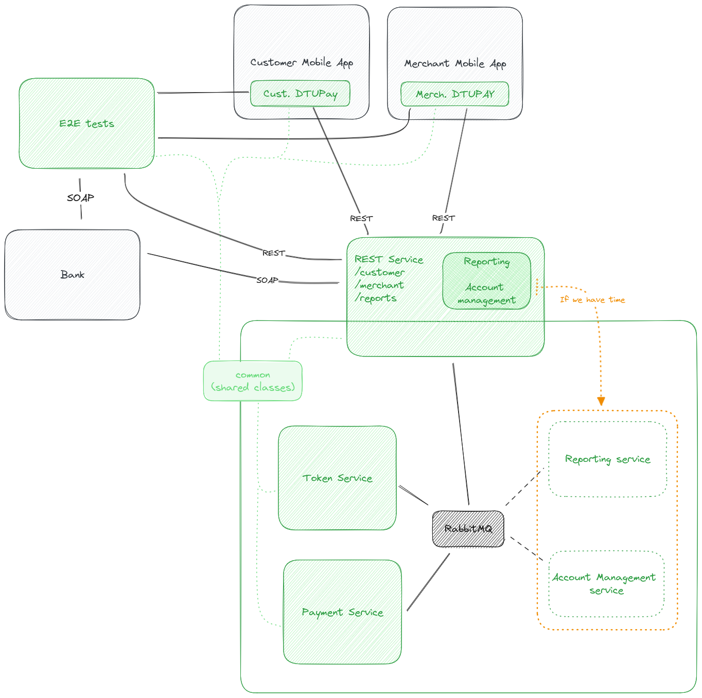

# MicroPay

This repo contains all services and related libraries for DTUPay.

## Building/Running

> Note: `common` is a common library used to synchronize classes between services/tests that. After you make changes you will have to run a `mvn package` in common, and perhaps `mvn install` in the projects that depend on it (not sure about the second part).

### Development

- Run the server `cd rest-service && mvn quarkus:dev`
- In a separate window, run the end-to-end tests `cd e2e && mvn test`

### Production

- Package the server `cd rest-service && mvn clean install && mvn package`
- Run the server in docker from the root of the repository `docker compose up`
- Run the end-to-end tests: `cd e2e && mvn test`

## Architecture Diagram

